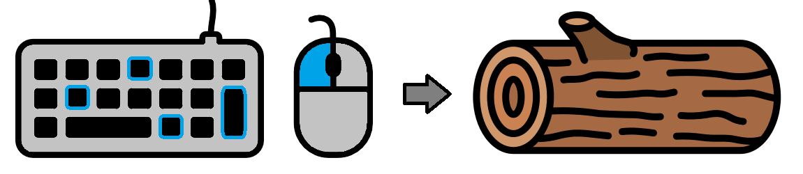
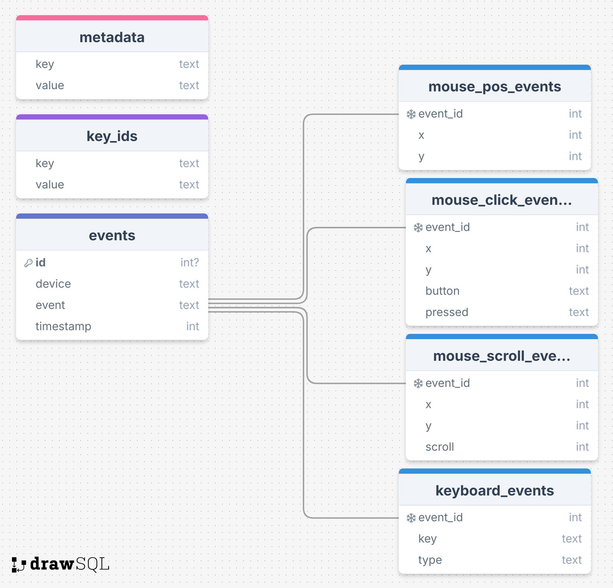

# Input Logger

`inputlog` is simple input logger app written in Python. It can log your mouse and keyboard actions and save them to a 
local SQL database.  




## Usage

### How to run the app?

The app is tested and works on Windows 11. However, it should also work on Linux and macOS. Before running the app 
please make sure you have installed the latest version of [Python](https://www.python.org/downloads/). Furthermore, it is advisable to use Python and 
install the required dependencies inside a [virtual environment](https://docs.python.org/3/library/venv.html). To run the app, copy the following commands into
your terminal of choice:   

1. Clone the repository and navigate to the folder.
    ```sh
    git clone https://github.com/MarkoLeskovar/Input-Logger
    cd Input-Logger
   ```

2. Create a virtual environment with a name ".venv".
    ```sh
    python -m venv .venv
    ```

3. Activate the virtual environment.
   - on Windows
      ```sh
      source .venv/Scripts/activate
      ```
   - on Linux
      ```sh
      source .venv/bin/activate
      ```

4. For local development install `inputlog` in editable mode.
   ```sh
   pip install -e .
   ```

5. Run the app in verbose mode and save results in the "output.db" database.
   ```sh
   inputlog -v -d output.db
   ```

### How to create an executable app?

The app can also be used without a local Python interpreter. This is achieved thought the use of  [PyInstaller](https://pyinstaller.org/en/stable/). 
You can create the executable `inputlog.exe` file yourself by following the instructions above and running the 
[`main_install.py`](install/main_install.py) as follows:
   
   ```sh
   python ./install/main_app.py
   ```


### How to run the app in the background?

To quietly run the app as a background process on Windows, copy the following command into the PowerShell 
terminal:

   ```powershell
   Start-Process .\inputlog.exe -WindowStyle Hidden -ArgumentList "-d output.db"
   ```


## Database structure

The recorded mouse and keyboard data is saved into a local SQLite database consisting of the following tables: 

- `metadata` - Contains information such as operating system and start time (in ms since epoc).
- `key_ids` - Contains names of abbreviations (key-values pairs) used the SQL tables.
- `events` - Main table consisting of mouse and key events. Details are recorded in:
  - `mouse_pos_events`
  - `mouse_click_events`
  - `mouse_scroll_events`
  - `keyboard_events`

Mouse position `x` and `y` is recorded in pixel screen coordinates, with origin in the top left. Timestamp is recorded 
in milliseconds since the database creation. For more details on possible datatypes and key identifiers,take a look in
[`database.py`](src/inputlog/database.py) file. 




## Minimal Python example

The input logger can also be used within the Python code environment as follows:

```python
from inputlog import InputLogger

# Create the logger
logger = InputLogger(
    database='output.db', 
    mouse_pos=True,
    mouse_click=True,
    mouse_scroll=True,
    keyboard=True,
    debug=True
)

# Run until KeyboardInterrupt
logger.run()
```


## Next steps and development ideas

- [ ] Add various analysis scripts
- [ ] Add support for taking screenshots
- [ ] Save results to an online database
